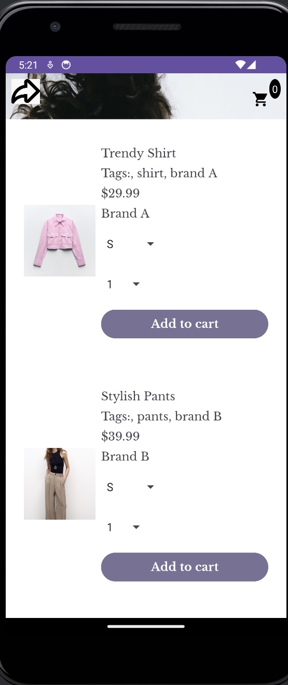
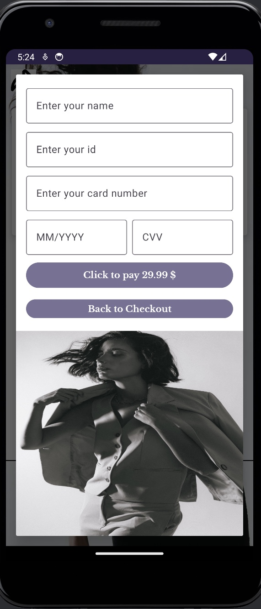
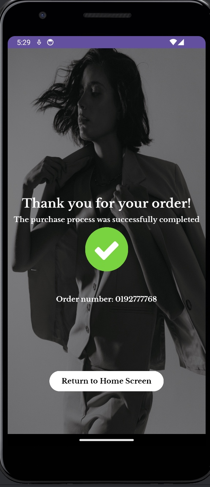
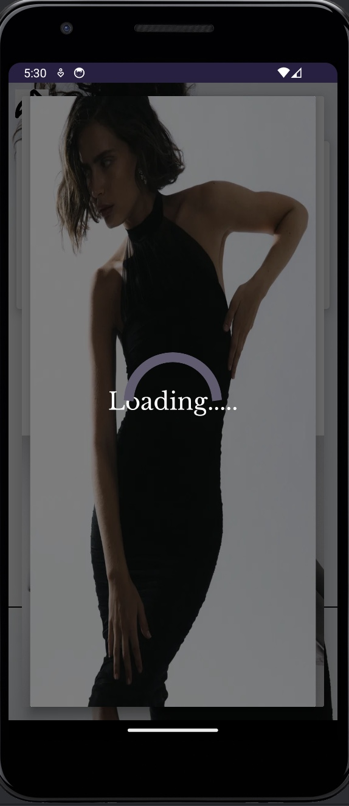

# UppStyle
An Android clothing store app built with Kotlin.

## Overview
UppStyle is a fashion showcase application that lets users explore a variety of clothing items, select and manage their shopping list, and confirm their purchases. The app was developed as part of the Android User Interface Drill at Reichman University, adhering to strict requirements for animations, UI responsiveness, and localization.

## Features
- **Gallery of Fashion Items:**
  - Browse a collection of fashion items with details like title, price, size, and brand.
  - Click on an item to add it to the checkout list.
  - Selected items are visually distinct from unselected items.
  - Long-press on a selected item to open a custom dialog that allows removing it from the list.

- **Checkout Process:**
  - View a summary of selected items and their total price.
  - Confirm purchases through an interactive dialog displaying the user's selection.

- **Animations:**
  - Four distinct animations implemented as part of the drill requirements:
    1. Fade-in and fade-out transitions.
    2. Scaling effect on item selection.
    3. Sliding transitions for navigation between screens.
    4. Highlight effect on items added to the checkout list.

- **Localization:**
  - Supports English (`en`) and Hebrew (`iw`) with optimized layouts for both portrait and landscape orientations.

- **Responsive User Interface:**
  - The UI dynamically adjusts to different screen sizes and orientations, ensuring a consistent experience across devices.

## Screenshots






## Technical Details
- **Activities:**
  - **LoadingActivity**: Displays a loading animation on app launch.
  - **MainActivity**: Displays the gallery of items and allows item selection.
  - **GalleryActivity**: Manages item views and user interactions.
  - **CheckoutActivity**: Summarizes selected items and handles purchase confirmation.
  - **OrderConfirmationActivity**: Displays confirmation details for the user's purchase.

- **Custom Dialogs:**
  - Custom-designed dialog for managing selected items, created with a unique XML layout.

- **Animations:**
  - Four distinct animations implemented as part of the drill requirements:
    - Fade-in and fade-out transitions.
    - Scaling effect on item selection.
    - Sliding transitions for navigation between screens.
    - Highlight effect on items added to the checkout list.

- **Widgets:**
  - Variety of widgets, including:
    - RecyclerView for displaying items.
    - Buttons for navigation and checkout.
    - Custom-designed views for dialogs and interactive components.

## Installation
1. Clone this repository:
   ```bash
   git clone https://github.com/MaayanWate/UppStyle.git

## Credits
Developed by Maayan Wate.


